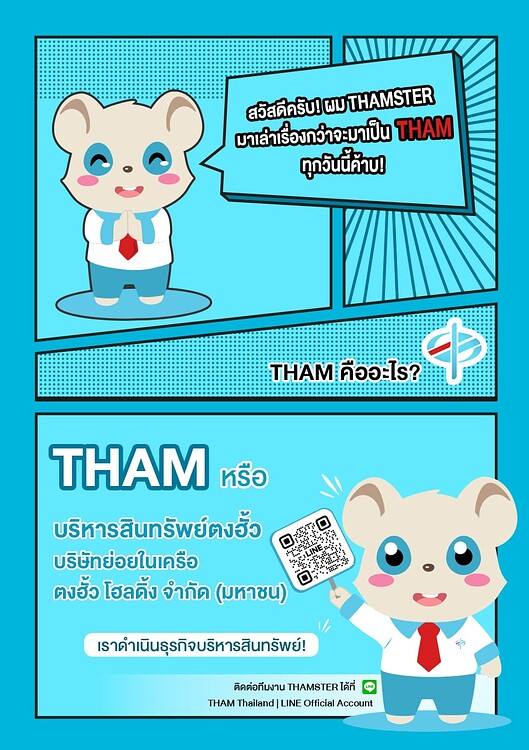

หลายคนอาจจะยังไม่รู้จักว่าเราคือใคร วันนี้น้อง THAMSTER ขอเป็นตัวแทน THAM ในการบอกเล่าเรื่องราวกว่าจะมาเป็น THAM ทุกวันนี้นะค้าบบบบบบ

### *THAM หรือ บริหารสินทรัพย์ตงฮั้ว บริษัทย่อยในเครือ ตงฮั้ว โฮลดิ้ง จำกัด (มหาชน) ก่อตั้งในปี 2564 เพื่อดำเนินธุรกิจบริหารสินทรัพย์ด้อยคุณภาพ โดยการการประมูลซื้อหนี้จากสถาบันการเงินหรือบริษัทต่างๆ ที่มีนโยบายขายหนี้ด้อยคุณภาพทั่วไปครับ*

โดยบริษัทฯ มุ่งหวังเป็นส่วนสำคัญในการแก้ไขปัญหาสินทรัพย์ด้อยคุณภาพของระบบการเงิน ด้วยการรับซื้อรับโอนหนี้จากสถาบันการเงินต่างๆ เพื่อนำมาบริหารจัดการผ่านกระบวนการติดตามทวงถาม และปรับโครงสร้างหนี้กับลูกหนี้ ภายใต้หลักธรรมาภิบาล เพื่อประโยชน์ต่อลูกหนี้และภาพรวมเศรษฐกิจ

ทางบริษัทฯ เรานั้นมี**จุดมุ่งหมายในการพิจารณาใช้แนวทางในการเจรจา เสนอโครงการให้ส่วนลด หรือการแบ่งชำระ เพื่อลดภาระหนี้** โดยพิจารณาจากความสามารถในการชำระหนี้ของลูกหนี้เป็นหลักครับ เพื่อหาข้อยุติที่ได้รับผลประโยชน์สูงสุดร่วมกันทั้งสองฝ่าย

ส่วนเพจนี้ เรามีเป้าหมายจะกระจายข้อมูลควรรู้ ข่าวสารต่างๆที่เป็นประโยชน์ทางด้านการเงิน การวางแผนการเงินกับบุคคลทั่วไป และประกาศสำคัญจากทางTHAM เพื่อให้ลูกหนี้หรือคนที่สนใจเรื่องการวางแผนการเงินได้รับรู้อย่างทั่วถึงครับ

หากคุณคือคนหนึ่งที่กำลังอ่านโพสต์นี้อยู่ ช่วยกดติดตามเราไว้ เพื่อไม่พลาดข้อมูลดีๆที่ทาง THAM คัดสรรมาให้นะครับผม

ส่วนผม THAMSTER หนูน้อยน่ารักพร้อมจะเป็นผู้ช่วย ผู้รับฟัง พร้อมอยู่เคียงข้างลูกเพจทุกท่านของ THAM

## หากมีข้อสงสัย หรือข้อมูลที่อยากรู้เพิ่มเติม ไม่ว่าจะขอปรับโครงสร้างหนี้ อยากขอ HC ติดต่อทีมงาน THAMSTER

## ได้ที่ LINE : [THAM Thailand | LINE Official Account](https://lin.ee/38M2xnN)

ขอบคุณครับ แล้วแวะมาคุยกับผมบ่อยๆนะค้าบบบบบ