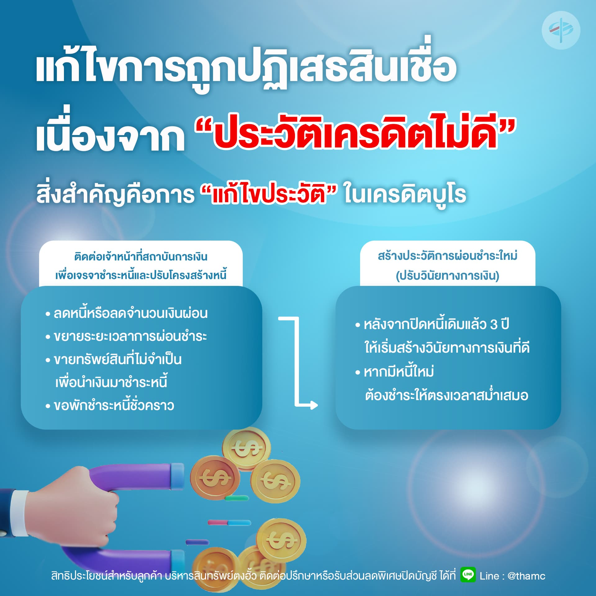

การแก้ไขปัญหาการถูกปฏิเสธสินเชื่อเนื่องจาก “ประวัติเครดิตไม่ดี” สิ่งสำคัญคือการ “แก้ไขประวัติ” ที่อยู่ในเครดิตบูโร ซึ่งสามารถทำได้ แต่ต้องใช้เวลาและความพยายามในการสร้างวินัยทางการเงินที่ดี โดยมีขั้นตอนสำคัญ ดังนี้

1. #### ติดต่อกับสถาบันการเงินที่เป็นเจ้าหนี้  เจรจาเพื่อชำระหนี้ให้เสร็จสิ้น หากมีหนี้สินจำนวนมาก ควรเจรจาปรับปรุงโครงสร้างหนี้

**• ลดหนี้หรือลดจำนวนเงินผ่อน**

**• ขยายระยะเวลาการผ่อนชำระ**

**• ขายทรัพย์สินที่ไม่จำเป็นเพื่อนำเงินมาชำระหนี้**

**• ขอพักชำระหนี้ชั่วคราว**

2. #### สร้างประวัติการผ่อนชำระใหม่ (ปรับวินัยทางการเงิน)

**• หลังจากปิดหนี้เดิมแล้ว 3 ปี ให้เริ่มสร้างวินัยทางการเงินที่ดี**

**• หากมีหนี้ใหม่ ต้องชำระให้ตรงเวลาสม่ำเสมอ**

##### การปฏิบัติตามขั้นตอนเหล่านี้อย่างเคร่งครัดจะช่วยลดความกังวลใจและปรับปรุงประวัติทางการเงินให้ดีขึ้น ส่งผลให้มีโอกาสได้รับการอนุมัติสินเชื่อในอนาคต
หากท่านพบว่าไม่สามารถขอสินเชื่อได้ ควรตรวจสอบประวัติเครดิตบูโรโดยเร็ว และรีบแก้ไขหากพบปัญหาการค้างชำระหรือประวัติทางการเงินที่ไม่ดี
การมีวินัยทางการเงิน ประวัติการผ่อนชำระที่ดี และรายได้ที่ชัดเจนและมั่นคง จะเป็นปัจจัยสำคัญที่ช่วยเพิ่มโอกาสในการได้รับอนุมัติสินเชื่อในอนาคต

สิทธิประโยชน์สำหรับลูกค้า บริหารสินทรัพย์ตงฮั้ว ติดต่อปรึกษา หรือรับส่วนลดพิเศษปิดบัญชี ได้ที่ LINE Official Account: @thamc <https://lin.ee/38M2xnN>